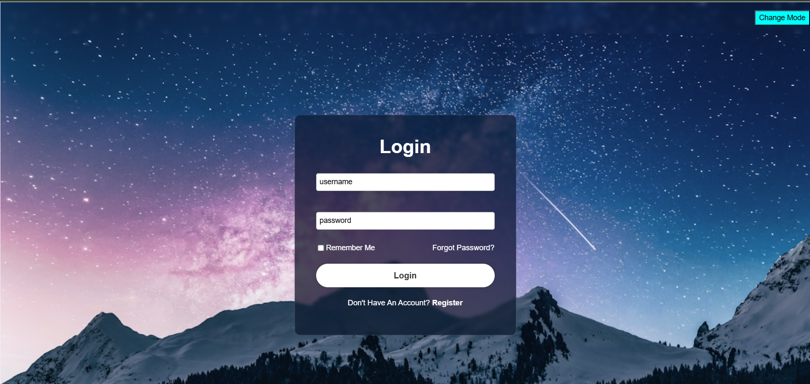
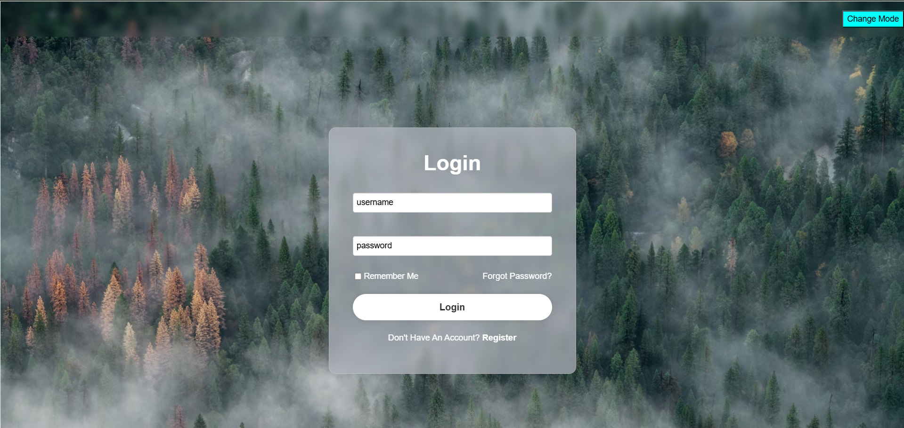

# 🌐 Login Form with Light/Dark Mode Toggle

A simple and beautiful **Login Form** built using **HTML**, **CSS**, and **JavaScript**, featuring a **theme toggle button** that switches between **light mode** and **dark mode** using dynamic backgrounds and modern UI effects like glassmorphism.

---

## 🚀 Features

- ✅ Responsive login layout
- 🌙 Light/Dark mode toggle with a single button
- 🖼️ Dynamic full-screen background images
- 💎 Smooth glassmorphism effect using `backdrop-filter`
- 🔐 Functional login form with username/password fields
- 🔄 Links for "Forgot Password" and "Register"

---

### 🌌 Dark Mode  

### 🌫️ Light Mode  

## 🛠️ Technologies Used

- **HTML5** – structure
- **CSS3** – styling, blur effects, layout
- **JavaScript** – toggling theme and styles dynamically

---

## 📂 Project Structure

login-form/
├── index.html
├── style.css
├── script.js
├── dark-mode.png
├── light-mode.png
└── README.md

